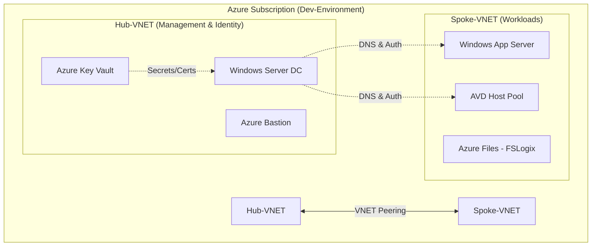

# 🚀 Azure Dev Infrastack Project

This personal project is an end-to-end Infrastructure as Code (IaC) showcase. It automates the deployment of a complete, production-ready Azure ecosystem-moving far beyond simple networking to include identity, security, and automated server configuration.


- [Architecture](#️-architecture)
  - [Networking](#-networking)
  - [Azure Naming Convention](#️-azure-naming-convention)
  - [Active Directory](#️-active-directory)

<br>

## 🏗️ Architecture

A streamlined Hub-and-Spoke architecture that centralizes a Windows Domain Controller for identity in the Hub, while isolating App Servers and AVD Host Pools within a secure Workload Spoke for automated, end-to-end management.



<br>

### 📦 Ressouce groups

- **rg-lino-mgmt-dev:** Storage (TF State), Key Vault
- **rg-lino-infra-dev:** VNETs, Peering, Bastion, Domain Controller
- **rg-lino-apps-dev:** vm-lino-app01, Managed Disks
- **rg-lino-avd-dev** Host Pools, DAGs, Workspaces, FSLogix Storage

<br>

### 🌐 Networking

A secure Hub-and-Spoke topology that uses VNET Peering to bridge a central identity hub with isolated workload spokes for servers and AVD.


**VNET Hub (vnet-lino-hub-dev-westeu)** <br>
Network for Management & Identity <br>
Address Space: 10.0.0.0/16

Subnets:
- snet-identity (10.0.1.0/24): for Domain Controllers (DC)
- AzureBastionSubnet (10.0.2.0/26): for Bastion
- snet-mgmt (10.0.3.0/24): for management tools

<br>

**VNET Workload (vnet-lino-workload-dev-westeu)** <br>
Network for Workload <br>
Address Space: 10.1.0.0/16

Subnets:
- snet-apps (10.1.1.0/24): For your Application Servers.
- snet-avd (10.1.2.0/24): For future AVD Session Hosts.

<br>

**VNET Peering**
- peer-hub-to-workload: Allows traffic from Hub to Spoke.
- peer-workload-to-hub: Allows traffic from Spoke to Hub.


<br>

### 🏷️ Azure Naming convention

**Azure networking resources**
- Virtual Network: vnet-lino-hub-dev-westeu, vnet-lino-workload-dev-westeu
- Subnet: snet-identity, snet-apps, snet-avd
- Network Security Group: nsg-lino-identity-dev
- Public IP: pip-bastion-lino-dev

**Azure compute resources**
- Domain Controller VM: vm-lino-dc01
- Application Server VM: vm-lino-app01
- Network Interface: nic-vm-lino-dc01
- OS Disk: osdisk-vm-lino-dc01
- Availability Set: as-lino-apps-dev

**azure storage resources**
- Storage Account: stlinodevstate001
- Key Vault: kv-lino-infra-dev-001
- Resource Group: rg-lino-infra-stack-dev
- Managed Identity: id-lino-imagebuilder-dev


<br>

### 📂 Active Directory

Active Directory Domain: corp.dev.surmatik.ch <br>
NetBIOS Name: LINODEV

Organizational Units (OUs)
```
┌──────────────────────────────────────────┐
│ OU=Lino                                  │
│  ├── OU=Servers                          │
│  │    └── OU=AVD                         │
│  ├── OU=Users                            │
│  ├── OU=Groups                           │
│  └── OU=Computers                        │
│       └── OU=Autopilot                   │
└──────────────────────────────────────────┘
```


## DevOps Setup

Azure cli comands to create the remote backend in azure

```azurecli
# Create the Management Resource Group
az group create --name rg-lino-mgmt-dev --location westeurope --subscription AzurePlan-Dev

# Create Storage Account for Terraform State
az storage account create --name stlinodevstate001 --resource-group rg-lino-mgmt-dev --sku Standard_LRS --encryption-services blob --subscription AzurePlan-Dev

# Create  Blob Container
az storage container create --name tfstate --account-name stlinodevstate001 --subscription AzurePlan-Dev
```

## Terraform

### Local deployment

```powershell
terraform init

terraform plan

terraform apply

terraform destroy -target="azurerm_resource_group.infra" -target="azurerm_resource_group.apps" -target="azurerm_resource_group.avd"
```

Get DC admin password
```azurecli
az keyvault secret show --name "identity-dc01-admin-pwd" --vault-name "kv-lino-dev-westeu-001" --query value -o tsv
```